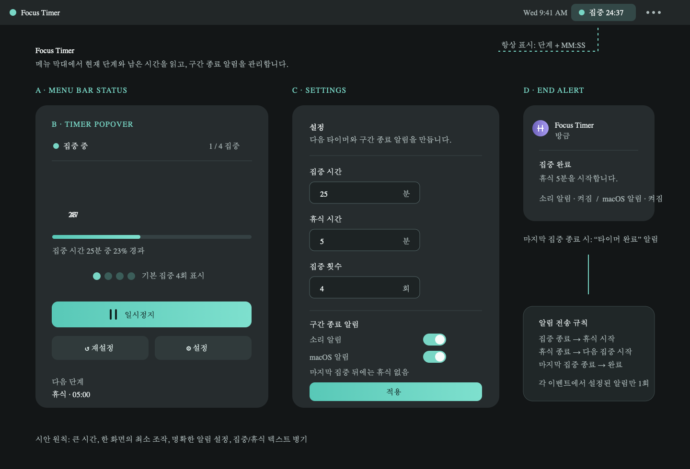
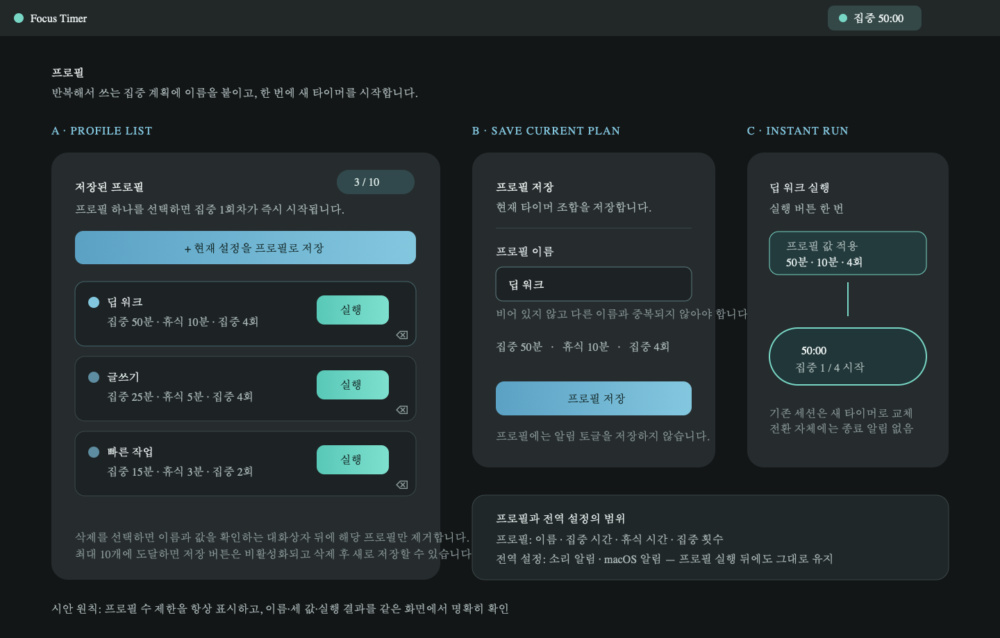

# Focus Timer

**Focus Timer**는 macOS 메뉴 막대에서 집중 시간을 관리하는 뽀모도로 타이머입니다.

앱을 열어 두면 남은 시간이 상단 메뉴 막대에 계속 표시됩니다. 메뉴 막대 시간을 클릭해 바로 시작·일시정지·설정·프로필 실행을 할 수 있습니다.

설정과 프로필은 별도 창을 띄우지 않고 같은 메뉴 막대 패널 안에서 열립니다. 왼쪽 화살표나 취소·닫기 버튼을 누르면 타이머 화면으로 돌아옵니다.

> 아래 이미지는 Focus Timer의 기능을 설명하기 위한 화면 예시입니다.

## 이렇게 시작하세요

1. 메뉴 막대의 `집중 25:00`을 클릭합니다.
2. **설정**에서 집중 시간, 휴식 시간, 집중 횟수를 정합니다.
3. **시작**을 누르면 집중 → 휴식이 자동으로 진행됩니다.
4. 마지막 집중이 끝나면 마지막 휴식 없이 완료됩니다.

## 메뉴 막대 타이머와 알림



### A. 메뉴 막대 상태

현재 단계와 남은 시간을 항상 표시합니다. 예: `집중 24:37`, `휴식 04:58`

### B. 타이머 조작

큰 시간 표시 아래에서 **시작**, **일시정지**, **재설정**을 할 수 있습니다.

현재 집중 횟수와 전체 횟수, 다음 단계도 함께 보여 줍니다. 예를 들어 4회로 설정하면 `집중 1 / 4`처럼 진행 상황을 확인합니다.

### C. 설정

- 집중 시간
- 휴식 시간
- 집중 횟수
- 구간 종료 소리 알림
- macOS 알림

반복 횟수는 집중 횟수입니다. 집중 4회라면 휴식은 마지막 집중 전까지 3회 진행됩니다.

### D. 구간 종료 알림

집중이 끝나면 휴식 시작을, 휴식이 끝나면 다음 집중 시작을 알려 줍니다.

마지막 집중이 끝나면 `타이머 완료` 알림을 보냅니다. 소리와 macOS 알림은 각각 끌 수 있습니다.

## 프로필로 바로 시작하기



자주 쓰는 집중 계획은 이름을 붙여 **최대 10개**까지 저장할 수 있습니다.

1. 현재 집중 시간·휴식 시간·집중 횟수에 이름을 붙여 저장합니다.
2. 프로필 목록에서 **실행**을 누르면 별도 불러오기 단계 없이 집중 1회차가 즉시 시작됩니다.
3. 실행 중인 타이머가 있어도 선택한 프로필이 새 세션으로 교체됩니다.

프로필에는 타이머 조합만 저장됩니다. 소리·macOS 알림 설정은 모든 프로필에 공통으로 유지됩니다.

## 빌드와 설치

```bash
./build.sh
./install.sh
```

`build.sh`는 아래 파일을 생성합니다.

- `dist/FocusTimer.app`
- `dist/FocusTimer.dmg`

`install.sh`는 `~/Applications/FocusTimer.app`에 설치합니다. 기존 앱이 있으면 새 앱을 먼저 준비한 뒤 안전하게 교체합니다.

## 테스트

```bash
swift run FocusTimerTDDTests
bash TDDTests/install-overwrite.sh
bash TDDTests/menu-panel-navigation.sh
```
