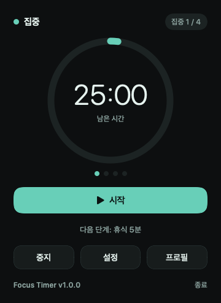
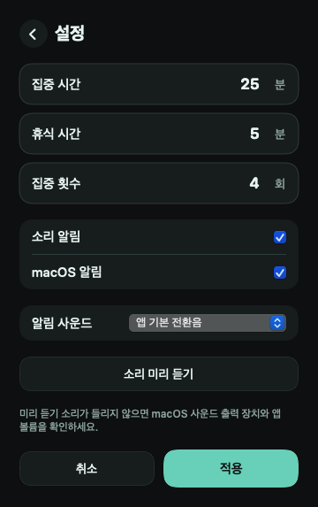
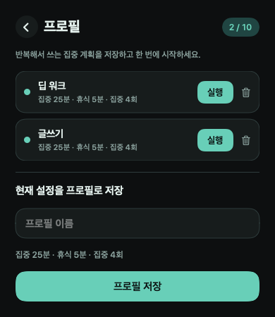

# Focus Timer

**Focus Timer**는 macOS 13+ 메뉴 막대에서 동작하는 뽀모도로 타이머입니다.

앱을 실행하면 상단 메뉴 막대에 현재 단계와 남은 시간이 표시됩니다. 예: `집중 25:00`, `휴식 05:00`

> 아래 이미지는 현재 `TimerPopoverView`, `SettingsView`, `ProfileListView` 코드에서 자동 렌더링한 실제 앱 패널입니다. 설계 시안이 아닙니다.

## 사용 흐름

```text
메뉴 막대 시간 클릭
        ↓
타이머 패널
  ├─ 시작 / 일시정지 / 중지
  ├─ 설정 패널
  └─ 프로필 패널
```

## 1. 타이머 패널

메뉴 막대 시간을 클릭하면 타이머 패널이 열립니다.



- 상단에 현재 단계와 `집중 현재횟수 / 전체횟수`를 표시합니다.
- 중앙의 원형 진행 표시와 큰 `MM:SS` 시간으로 현재 구간을 읽을 수 있습니다.
- **시작**을 누르면 타이머가 진행되고, 진행 중에는 **일시정지**로 바뀝니다.
- **중지**는 현재 계획의 첫 집중 시간으로 되돌립니다.
- 마지막 집중이 끝나면 마지막 휴식 없이 완료됩니다.

## 2. 설정 패널

타이머 패널의 **설정**을 누르면 같은 메뉴 막대 창 안에서 설정 패널로 전환됩니다.



- 집중 시간, 휴식 시간, 집중 횟수를 1 이상의 정수로 입력합니다.
- **소리 알림**과 **macOS 알림**을 각각 켜거나 끌 수 있습니다.
- **알림 사운드**에서 앱 기본 전환음 또는 macOS 시스템 사운드 중 하나를 고를 수 있습니다.
- **소리 미리 듣기**는 선택한 소리를 즉시 재생합니다.
- **적용**은 설정을 저장하고 타이머 패널로 돌아갑니다.
- **취소** 또는 왼쪽 화살표는 값을 적용하지 않고 타이머 패널로 돌아갑니다.
- 타이머가 실행 중이면 설정 입력과 적용은 비활성화됩니다. 타이머 패널에서 **일시정지**하거나 **중지**한 뒤 바꿀 수 있습니다.

설정과 프로필은 별도 창이나 sheet로 열리지 않습니다. 따라서 패널 안의 토글·텍스트 입력·버튼을 눌러도 메뉴 막대 앱이 닫히지 않아야 합니다.

## 3. 집중·휴식과 알림

집중 횟수는 집중 구간의 총 횟수입니다.

예를 들어 집중 4회를 설정하면 아래 순서로 실행됩니다.

```text
집중 1 → 휴식 → 집중 2 → 휴식 → 집중 3 → 휴식 → 집중 4 → 완료
```

- 마지막 전 집중이 끝나면 휴식이 자동으로 시작됩니다.
- 휴식이 끝나면 다음 집중이 자동으로 시작됩니다.
- 마지막 집중이 끝나면 **타이머 완료** 상태가 됩니다.
- 켜진 설정에 따라 각 자연 종료 시 앱 전용 chime과 macOS 로컬 알림을 보냅니다.

## 4. 프로필 패널

타이머 패널의 **프로필**을 누르면 같은 메뉴 막대 창 안에서 프로필 패널로 전환됩니다.



- 현재 집중 시간·휴식 시간·집중 횟수에 이름을 붙여 저장합니다.
- 프로필은 최대 10개까지 저장할 수 있습니다.
- 이름은 비어 있지 않아야 하며, 같은 이름은 중복 저장할 수 없습니다.
- 각 프로필의 **실행**을 누르면 해당 값으로 집중 1회차가 즉시 시작됩니다.
- 실행 중이거나 일시정지된 타이머가 있어도 프로필 실행은 새 세션으로 교체합니다.
- 프로필에는 타이머 조합만 저장합니다. 소리·macOS 알림은 모든 프로필에 공통인 전역 설정입니다.
- 삭제는 프로필 패널 안의 확인 영역에서 처리합니다.

## 빌드와 설치

```bash
./build.sh
./install.sh
```

`build.sh`는 아래 파일을 생성합니다.

- `dist/FocusTimer.app`
- `dist/FocusTimer.dmg`

`install.sh`는 `~/Applications/FocusTimer.app`에 설치합니다. 기존 앱이 있으면 새 앱을 임시로 준비한 뒤 안전하게 교체하며, 프로필과 설정은 유지됩니다.

## 버전

현재 버전은 **1.0.0**이며, 타이머 패널 왼쪽 아래에 `Focus Timer v1.0.0`으로 표시됩니다.

버전을 올릴 때는 아래 두 곳을 같은 `MAJOR.MINOR.PATCH` 값으로 바꿉니다. `TDDTests/app-version.sh`가 두 값이 같은지 검사합니다.

- `Sources/FocusTimerUI/AppVersion.swift`의 `AppVersion.current`
- `Resources/Info.plist`의 `CFBundleShortVersionString`

## 테스트

```bash
swift run FocusTimerTDDTests
bash TDDTests/install-overwrite.sh
bash TDDTests/menu-panel-navigation.sh
bash TDDTests/transition-sound.sh
bash TDDTests/custom-menu-ui-style.sh
bash TDDTests/readme-snapshot.sh
bash TDDTests/app-version.sh
```
