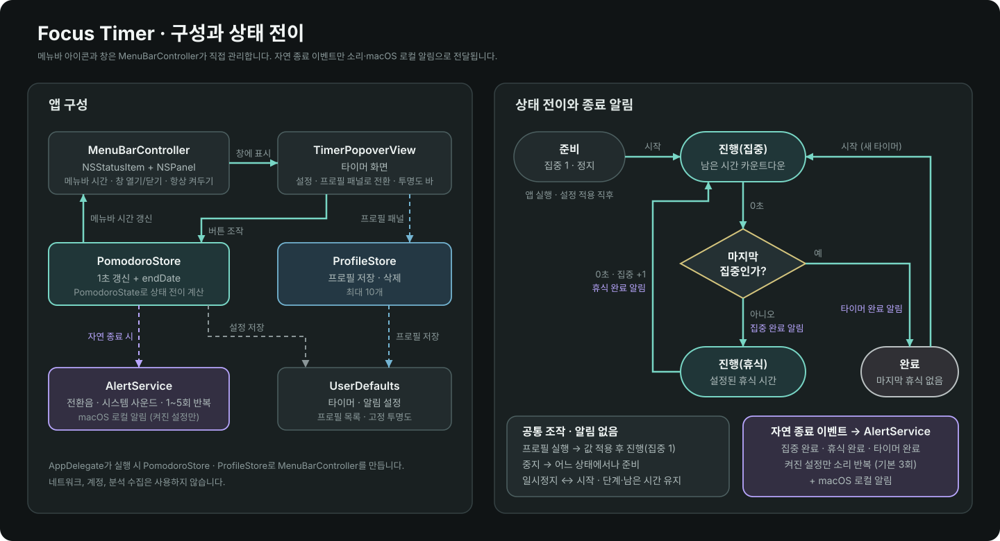
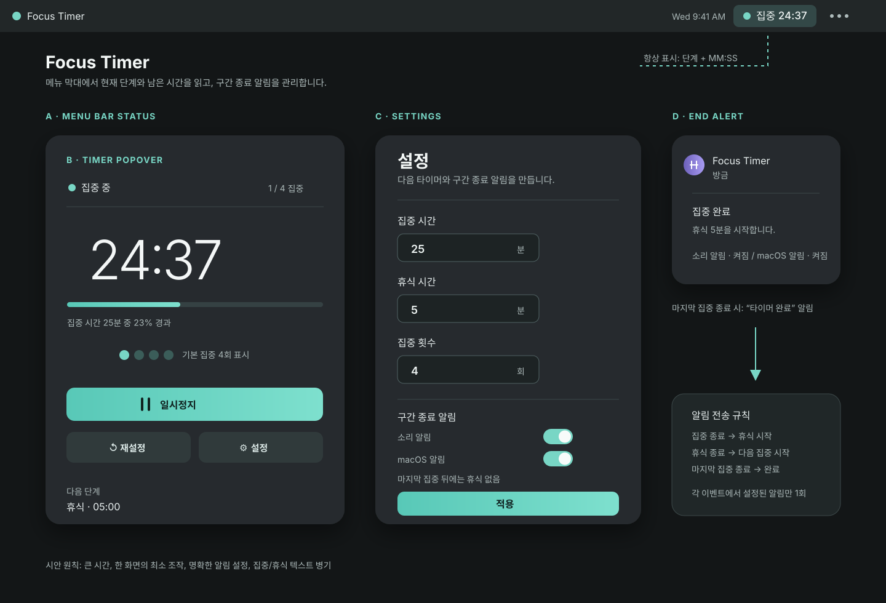
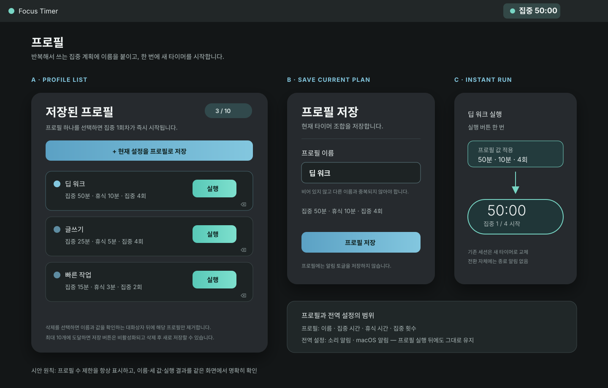

# Focus Timer macOS 메뉴 막대 앱 설계안

- 최초 작성: 2026-09-30 07:51 KST
- 최종 구현 반영: 2026-09-30 14:17 KST
- 상태: TDD 구현·패키징·아이콘 검증 완료
- 범위: 메뉴 막대 타이머, 집중·휴식 설정, 반복, 종료 알림, 타이머 프로필, 앱 아이콘, 빌드·설치 스크립트

## 목차

1. [요약](#1-요약)
2. [요구사항 대응](#2-요구사항-대응)
3. [확정된 제품 결정](#3-확정된-제품-결정)
4. [참고 화면 비교와 UI 방향](#4-참고-화면-비교와-ui-방향)
5. [프로필 설계](#5-프로필-설계)
6. [사용자 흐름과 상태 전이](#6-사용자-흐름과-상태-전이)
7. [구간 종료 알림 규칙](#7-구간-종료-알림-규칙)
8. [기술 설계](#8-기술-설계)
9. [빌드와 설치 계약](#9-빌드와-설치-계약)
10. [검증 계획](#10-검증-계획)
11. [범위 밖 항목](#11-범위-밖-항목)
12. [확정된 구현 기준](#12-확정된-구현-기준)

## 1. 요약

`Focus Timer`는 Dock 중심 창이 아니라 macOS 메뉴 막대에서 항상 남은 시간을 보여 주는 단일 사용자용 뽀모도로 앱입니다.

사용자는 집중 시간, 휴식 시간, 집중 횟수와 구간 종료 알림을 설정하거나, 이름을 붙인 타이머 프로필을 선택해 한 번에 실행할 수 있습니다. 프로필은 최대 10개이며 **집중 시간·휴식 시간·집중 횟수**만 저장합니다. 소리·macOS 알림 토글은 모든 프로필에 공통인 전역 설정입니다.

집중 횟수 x는 **집중을 x회 수행**한다는 뜻입니다. 마지막 집중 전까지는 `집중 → 휴식`을 자동 진행하고, **x번째 집중이 끝나면 마지막 휴식 없이 즉시 완료**됩니다.

집중 또는 휴식이 끝나면 시스템 기본 알림음을 재생하고 macOS 로컬 알림을 표시합니다. 소리와 배너 알림은 별도로 끌 수 있으며, 알림은 외부 서버나 계정 없이 현재 Mac에서만 처리합니다.

프로필의 `실행` 버튼은 세 타이머 값을 적용하고 즉시 집중 1회차를 시작합니다. 기존 타이머가 실행·일시정지 상태라면, 해당 실행은 의도적으로 기존 세션을 재설정하며 종료 알림은 보내지 않습니다.

구현은 macOS 13 이상을 대상으로 SwiftUI의 `MenuBarExtra`를 사용합니다. 이 선택은 AppKit 브리지를 피하고 가장 작은 구조로 메뉴 막대 앱을 만들기 위한 것입니다.







## 2. 요구사항 대응

| 요구사항 | 설계 대응 | 완료 판단 기준 |
| --- | --- | --- |
| 1. macOS 앱 | macOS 13+ SwiftUI 기반 `FocusTimer.app` | Finder에서 앱을 실행할 수 있습니다. |
| 2. 상단 bar 시간 표시 | `MenuBarExtra`의 상태 문자열에 현재 단계와 `MM:SS`를 표시합니다. | 실행·일시정지·휴식 중에도 메뉴 막대 시간이 갱신됩니다. |
| 3. 집중 시간 설정 | 설정 화면의 정수 분 입력값 `focusMinutes` | 저장 후 다음 시작의 집중 시간이 설정값입니다. |
| 4. 휴식 시간 설정 | 설정 화면의 정수 분 입력값 `breakMinutes` | 마지막 집중 전의 집중 종료 뒤 설정값만큼 휴식합니다. |
| 5. 집중 → 휴식 진행 | 마지막 집중 전의 집중 0초에서 자동으로 휴식 단계로 전환합니다. | 별도 클릭 없이 단계명과 시간이 바뀝니다. |
| 6. x회 반복 | `focusCount`를 집중 횟수로 사용합니다. | x번째 집중 종료 시 휴식 없이 완료 상태가 됩니다. |
| 7. 빌드 및 DMG | 루트 `build.sh`가 `dist/FocusTimer.app`, `dist/FocusTimer.dmg`를 생성합니다. | 두 산출물이 존재하고 DMG 검증이 통과합니다. |
| 8. 설치 | 루트 `install.sh`가 빌드 산출 앱을 `~/Applications`에 설치합니다. | 설치 뒤 해당 위치에서 앱을 열 수 있습니다. |
| 9. 구간 종료 소리·알림 | 시스템 알림음과 macOS 로컬 알림을 집중·휴식 종료 시 실행합니다. | 각 종료 이벤트에 맞는 알림이 한 번 표시되고, 두 설정을 독립적으로 끌 수 있습니다. |
| 10. 프로필 최대 10개 | `UserDefaults`에 최대 10개의 프로필을 저장합니다. | 10개 저장 후 새 저장은 막히고, 삭제 후 다시 저장할 수 있습니다. |
| 11. 프로필 이름 | 저장 시 필수 이름을 받습니다. | 공백 이름·중복 이름은 저장되지 않고 이유가 표시됩니다. |
| 12. 프로필 즉시 실행 | 목록의 `실행`이 값을 적용한 뒤 집중 1회차를 시작합니다. | 한 번의 실행 동작으로 메뉴 막대가 해당 프로필의 집중 시간으로 카운트다운합니다. |

## 3. 확정된 제품 결정

| 항목 | 확정값 | 설계 영향 |
| --- | --- | --- |
| 최소 macOS | macOS 13 Ventura 이상 | SwiftUI `MenuBarExtra`를 사용하고 AppKit 호환 계층은 만들지 않습니다. |
| 기본 타이머값 | 집중 25분, 휴식 5분, 집중 4회 | 사용자는 실행 직후 타이머를 시작하거나 값을 바꿀 수 있습니다. |
| 반복의 뜻 | x = 집중 횟수 | x회의 집중과 x−1회의 휴식이 실행됩니다. |
| 마지막 휴식 | 생략 | x번째 집중이 0초가 되면 완료로 전환하고 휴식 타이머를 만들지 않습니다. |
| 단계 전환 | 자동 시작 | 마지막 집중 전에는 0초가 되면 다음 휴식이 즉시 시작됩니다. |
| 소리 알림 | 기본 켜짐, 시스템 기본음 | `NSSound.beep()`을 한 번 재생합니다. 별도 음원·네트워크는 사용하지 않습니다. |
| macOS 알림 | 기본 켜짐, 로컬 배너 | 사용자가 권한을 허용하면 각 종료 이벤트를 로컬 알림으로 표시합니다. |
| 알림 설정 | 소리·배너를 독립 토글 | 한 기능을 꺼도 다른 기능은 계속 사용할 수 있습니다. |
| 프로필 내용 | 이름 + 집중 분 + 휴식 분 + 집중 횟수 | 알림 토글은 프로필에 복사하지 않고 전역 설정으로 유지합니다. |
| 프로필 수 | 최대 10개 | 새 프로필 저장은 10개 미만일 때만 가능합니다. |
| 프로필 이름 | 앞뒤 공백 제거 후 비어 있지 않고 고유해야 함 | 대소문자·공백 차이만 있는 중복 이름도 저장하지 않습니다. |
| 프로필 관리 | 생성, 실행, 삭제 | 삭제는 확인 대화상자를 거치며, 값·이름 수정은 삭제 후 새 프로필 저장으로 처리합니다. |
| 프로필 실행 | 값 적용 후 즉시 집중 1회차 시작 | 실행·일시정지 중인 타이머도 새 세션으로 재설정하며 종료 알림은 보내지 않습니다. |
| 설정 반영 | 타이머 수동 편집은 정지·완료 상태에서만 가능 | 프로필 실행은 사용자가 명시적으로 새 세션을 고르는 예외입니다. |
| 설치 위치 | `~/Applications/FocusTimer.app` | 관리자 권한 없이 현재 사용자 계정에 설치합니다. |

입력값은 모두 1분 이상의 정수와 1회 이상의 정수로 제한합니다. 상한, 긴 휴식, 사용자 지정 음원, 원격 푸시 알림, 프로필 동기화·정렬·수정은 현재 요구사항에 없으므로 추가하지 않습니다.

## 4. 참고 화면 비교와 UI 방향

참고 캡처는 `Flow` 앱의 어두운 카드, 큰 시간 표시, 원형 진행 표시, 재생 버튼, 메뉴 막대 진입을 보여 줍니다. 이 중 타이머를 한눈에 읽는 장점만 유지하고, 업그레이드·통계·태그 등 요청되지 않은 메뉴는 포함하지 않습니다.

| 구분 | 참고 화면의 관찰점 | Focus Timer 개선안 |
| --- | --- | --- |
| 첫 화면 | `50:00` 중심의 큰 카운트다운 | 단계명, `현재/전체 집중 횟수`, 다음 단계까지 함께 보여 현재 맥락을 분명히 합니다. |
| 진행 표시 | 4개의 점으로 진행 상태를 암시 | 기본 4회에서는 점을 사용하되, 실제 기준은 항상 `현재 / 전체` 텍스트로 표시합니다. |
| 구간 종료 | 캡처에서 종료 알림을 확인할 수 없음 | 시스템음과 로컬 배너로 다음 단계 또는 완료를 즉시 알립니다. |
| 재사용 계획 | 캡처에서 이름 있는 타이머 조합을 빠르게 실행하는 흐름을 확인할 수 없음 | 프로필 목록에서 이름·세 값 요약을 읽고 한 번에 실행합니다. |
| 메뉴 | 업그레이드·통계·태그 등 여러 항목 | 설정, 프로필, 재설정, 종료만 두어 뽀모도로 동작에 집중합니다. |
| 메뉴 막대 | 시간만 작게 표시 | `● 24:37`(집중)과 `◐ 04:58`(휴식)처럼 단계와 시간을 함께 표시합니다. |

### 화면 구성

1. **메뉴 막대 상태 항목**: 앱 실행 직후 `● 25:00`을 표시합니다. 클릭하면 타이머 팝오버가 열립니다.
2. **타이머 팝오버**: 단계명, 큰 시간, `1 / 4 집중`, 시작/일시정지, 재설정, 설정·프로필 진입을 제공합니다.
3. **설정 창**: 집중 시간, 휴식 시간, 집중 횟수, `소리 알림`, `macOS 알림`을 입력·토글하고 적용합니다.
4. **프로필 창**: 현재 값에 이름을 붙여 저장하고, 목록에서 `실행` 또는 `삭제`를 선택합니다. `3 / 10`처럼 현재 개수를 항상 표시합니다.
5. **로컬 알림 배너**: 종료 시점에 다음 행동을 한 문장으로 보여 줍니다. 앱이 앞에 열려 있을 때도 배너를 표시합니다.

샘플 화면의 색상은 집중에 청록색, 휴식에 보라색을 사용합니다. 색상만으로 단계를 구분하지 않고 텍스트도 함께 표시합니다.

## 5. 프로필 설계

### 데이터와 저장 범위

```text
TimerProfile
├── id: UUID
├── name: String
├── focusMinutes: Int
├── breakMinutes: Int
└── focusCount: Int
```

`id`는 이름을 바꾸거나 표시 순서가 달라져도 특정 프로필을 안전하게 식별하기 위한 값입니다. 사용자에게는 이름과 `집중 N분 · 휴식 N분 · N회` 요약만 표시합니다.

프로필에는 타이머 조합만 저장합니다. 소리 알림·macOS 알림, 현재 남은 시간, 실행 상태, 완료 이력은 프로필에 저장하지 않습니다.

### 저장과 관리

1. 사용자는 정지·완료 상태에서 현재 타이머 값을 열고 `현재 설정을 프로필로 저장`을 선택합니다.
2. 이름을 입력하면 앞뒤 공백을 제거한 뒤 비어 있지 않은지와 기존 이름 중복 여부를 검사합니다.
3. 유효하고 목록이 10개 미만이면 새 프로필을 저장합니다.
4. 목록이 10개이면 저장 버튼을 비활성화하고 `프로필은 최대 10개입니다. 삭제 후 새로 저장하세요.`를 표시합니다.
5. 삭제는 해당 프로필의 이름과 값을 보여 주는 확인 대화상자 뒤에만 수행합니다. 삭제가 끝나면 즉시 새 슬롯이 생깁니다.

이름과 조합을 바꾸는 전용 수정 기능은 추가하지 않습니다. 현재 요청의 최소 범위에서는 기존 프로필을 삭제하고 새 이름·값으로 저장합니다.

### 즉시 실행

프로필 카드의 `실행`은 별도의 “불러오기” 단계 없이 아래 작업을 하나의 사용자 동작으로 수행합니다.

1. 현재 타이머가 실행·일시정지 상태여도 이를 조용히 재설정합니다.
2. 선택한 프로필의 세 값을 현재 계획에 적용합니다.
3. `집중 1 / 전체 집중 횟수`와 프로필의 집중 시간으로 초기화합니다.
4. 타이머를 즉시 시작하고 메뉴 막대 시간을 갱신합니다.

프로필 실행은 타이머가 자연스럽게 끝난 것이 아니므로 소리·macOS 종료 알림을 보내지 않습니다. 이후 실제 구간 종료부터는 전역 알림 토글을 적용합니다.

## 6. 사용자 흐름과 상태 전이

### 기본 흐름

`앱 실행 → 메뉴 막대에서 타이머 열기 → 값·알림 설정 또는 프로필 선택 → 시작 → 집중 종료(소리·알림) → 마지막 집중 전이면 휴식 자동 시작 → 휴식 종료(소리·알림) → 다음 집중 → 마지막 집중 종료(소리·완료 알림) → 완료`

프로필 빠른 실행 흐름은 `프로필 목록 → 실행 → 기존 타이머 재설정(필요 시) → 프로필 값 적용 → 집중 1회차 즉시 시작`입니다.

초기 상태는 `준비(집중)`입니다. 타이머를 일시정지하면 남은 초를 보존하고, 다시 시작하면 같은 단계에서 이어집니다. 재설정은 현재 계획의 첫 집중 시간으로 되돌립니다.

### 상태 전이 규칙

| 현재 상태 | 이벤트 | 다음 상태 | 집중 횟수 값 | 종료 알림 이벤트 |
| --- | --- | --- | --- | --- |
| 준비(집중) | 시작 | 진행(집중) | 1 | 없음 |
| 준비·진행·일시정지·완료 | 프로필 실행 | 진행(집중) | 1 | 없음 |
| 진행(집중) | 일시정지 | 일시정지(집중) | 유지 | 없음 |
| 진행(집중) | 0초, 현재 횟수 < 집중 횟수 | 진행(휴식) | 유지 | `focusEnded` |
| 진행(집중) | 0초, 현재 횟수 = 집중 횟수 | 완료 | 유지 | `timerCompleted` |
| 진행(휴식) | 일시정지 | 일시정지(휴식) | 유지 | 없음 |
| 진행(휴식) | 0초 | 진행(집중) | 1 증가 | `breakEnded` |
| 일시정지 또는 완료 | 재설정 | 준비(집중) | 1 | 없음 |

카운트다운은 매 초 값을 단순 차감하지 않고 종료 예정 시각(`endDate`)과 현재 시각의 차이로 남은 시간을 계산합니다. 따라서 앱이 잠시 응답하지 않거나 Mac이 잠자기에서 돌아와도 시간이 누적해서 늦어지지 않습니다.

## 7. 구간 종료 알림 규칙

종료 이벤트는 한 상태 전이에서 최대 한 번 발생합니다. 일시정지, 재시작, 재설정, 설정 변경, 프로필 실행에는 소리나 배너를 보내지 않습니다.

| 이벤트 | 발생 시점 | 시스템음 | 로컬 알림 제목 | 로컬 알림 본문 |
| --- | --- | --- | --- | --- |
| `focusEnded` | 마지막 전 집중이 0초가 됨 | 켜짐이면 1회 | 집중 완료 | `휴식 {breakMinutes}분을 시작합니다.` |
| `breakEnded` | 휴식이 0초가 됨 | 켜짐이면 1회 | 휴식 완료 | `집중 {focusCount} / {totalFocusCount}를 시작합니다.` |
| `timerCompleted` | 마지막 집중이 0초가 됨 | 켜짐이면 1회 | 타이머 완료 | `집중 {totalFocusCount}회를 완료했습니다.` |

### 권한과 중복음 처리

- `macOS 알림`을 처음 켜고 적용할 때 `UNUserNotificationCenter` 권한을 요청합니다.
- 사용자가 권한을 거부하거나 macOS 집중 모드가 배너를 억제하면 앱은 실패하지 않고, 켜진 시스템음만 재생합니다.
- 소리는 `NSSound.beep()`이 담당합니다. 로컬 알림 payload에는 별도 알림음을 넣지 않아, 하나의 종료 이벤트에서 소리가 두 번 나지 않게 합니다.
- 앱이 전면에 있어도 notification-center delegate가 배너 표시를 허용합니다.
- 모든 알림은 로컬입니다. 서버 요청, 원격 푸시, 개인 데이터 전송은 없습니다.

## 8. 기술 설계

### 실제 구현 구성

- **UI**: `FocusTimerUI` 모듈의 단일 SwiftUI `MenuBarExtra` 창 안에서 타이머·설정·프로필을 인라인 패널로 전환합니다. 공통 다크 차콜·청록 테마와 맞춤 버튼·입력·프로필 카드를 사용하며, 별도 sheet는 사용하지 않습니다.
- **상태**: `FocusTimerCore`의 순수 `PomodoroState`가 단계·남은 시간·현재 집중 횟수를 전이합니다. `PomodoroStore`가 실제 시계와 메뉴 막대 UI를 연결합니다.
- **시간원**: 1초 UI 갱신 타이머와 `endDate` 차이로 남은 시간을 계산합니다. Mac이 잠자기에서 돌아와도 단순 초 차감 누적 오차가 생기지 않습니다.
- **프로필 영속화**: `ProfileStore`가 `[TimerProfile]`을 JSON으로 `UserDefaults`에 저장하고 최대 10개·이름 유효성을 검사합니다.
- **알림**: `AlertService`가 번들 `transition.wav`를 우선 재생하고 재생 실패 시에만 `NSSound.beep()`으로 fallback 합니다. macOS 로컬 배너도 전달합니다.
- **전역 설정 영속화**: `PomodoroStore`가 집중 분·휴식 분·집중 횟수·소리 활성화·알림 활성화를 `UserDefaults`에 저장합니다.
- **문서 화면**: `FocusTimerReadmeSnapshot` 도구가 실제 `TimerPopoverView`·`SettingsView`·`ProfileListView`를 off-screen 렌더링해 README PNG를 생성합니다.
- **데이터 범위**: 네트워크 통신, 계정, 분석 수집을 두지 않습니다.

### 실제 파일 구조

```text
FocusTimer/
├── Package.swift
├── Sources/
│   ├── FocusTimerCore/
│   │   ├── Models.swift           # 설정, 상태 전이, 종료 이벤트, 프로필 모델
│   │   └── ProfileStore.swift     # 최대 10개 저장·이름 검증·삭제
│   ├── FocusTimerUI/
│   │   ├── AlertService.swift     # 번들 전환음·로컬 알림 전달
│   │   ├── FocusTheme.swift       # 다크 차콜·청록 맞춤 스타일
│   │   ├── PomodoroStore.swift    # 실제 시계, UserDefaults, 프로필 즉시 실행
│   │   ├── TimerPopoverView.swift # 원형 타이머·맞춤 액션 UI
│   │   ├── SettingsView.swift     # 카드형 시간 입력·알림·미리 듣기 UI
│   │   └── ProfileListView.swift  # 프로필 카드·실행·삭제·저장 UI
│   └── FocusTimerApp/
│       └── FocusTimerApp.swift    # MenuBarExtra 앱 진입점
├── Tools/
│   └── FocusTimerReadmeSnapshot/
│       └── main.swift             # 실제 SwiftUI 패널 PNG 생성 도구
├── TDDTests/
│   ├── FocusTimerTDDTests.swift   # 상태 전이·프로필·종료 이벤트 15개 TDD 테스트
│   ├── install-overwrite.sh       # 기존 설치본 overwrite 격리 테스트
│   ├── menu-panel-navigation.sh   # MenuBarExtra 인라인 패널 회귀 테스트
│   ├── transition-sound.sh        # 번들 전환음·미리 듣기 회귀 테스트
│   ├── custom-menu-ui-style.sh    # 맞춤 다크 UI 회귀 테스트
│   └── readme-snapshot.sh         # 실제 타이머·설정·프로필 PNG 회귀 테스트
├── Resources/
│   ├── Info.plist                 # macOS 13+, 메뉴 막대 전용 번들 설정
│   ├── AppIcon.svg                # 편집 가능한 앱 아이콘 원본
│   ├── AppIcon.icns               # 모든 macOS 해상도를 담은 번들 아이콘
│   └── transition.wav             # 집중·휴식 전환용 앱 전용 chime
├── build.sh
├── install.sh
└── .gitignore
```

현재 환경은 macOS Command Line Tools만 제공하고 `XCTest`·전체 Xcode가 없습니다. 따라서 외부 의존성을 추가하지 않고 `FocusTimerTDDTests` 실행 타깃으로 RED→GREEN을 수행했습니다. 이 타깃은 일반 Swift 실행 파일이며 `swift run FocusTimerTDDTests`로 실행합니다.

## 9. 빌드와 설치 계약

### `build.sh`

실행 명령은 루트에서 `./build.sh`입니다.

1. `swift build --configuration release --product FocusTimer`로 macOS 13+ Release 실행 파일을 빌드합니다.
2. 실행 파일, `Resources/Info.plist`, `Resources/AppIcon.icns`, `Resources/transition.wav`를 `dist/FocusTimer.app` 번들로 만듭니다. `LSUIElement`가 설정되어 Dock 대신 메뉴 막대 앱으로 실행되고 Finder에는 생성한 앱 아이콘이 표시됩니다.
3. 앱 번들과 `/Applications` 별칭을 담은 DMG를 `dist/FocusTimer.dmg`으로 생성합니다.
4. `plutil -lint`와 `hdiutil verify`가 통과해야 성공으로 끝납니다.

로컬 개발용 산출물에는 코드 서명·공증을 포함하지 않습니다. 외부 배포 시에는 Apple Developer ID 서명과 notarization이 별도로 필요하며, 서명되지 않은 앱은 Gatekeeper 경고를 보일 수 있습니다.

### `install.sh`

실행 명령은 `./install.sh`입니다.

1. `dist/FocusTimer.app`이 없으면 실패 이유와 함께 종료합니다.
2. `~/Applications`를 만들고 앱 번들을 `~/Applications/FocusTimer.app`에 설치합니다.
3. 동명 앱이 이미 있으면 새 번들을 `~/Applications`의 임시 경로에 완성한 뒤 기존 번들을 백업하고 교체합니다. 교체 실패·중단 시 백업을 원래 경로로 복원합니다.
4. 설치 성공 뒤 설치 경로와 기존 앱 교체 여부를 출력합니다.

DMG는 배포·드래그 설치용, `install.sh`는 현재 사용자의 빠른 설치용으로 역할을 분리합니다.

## 10. 검증 결과

TDD는 UI보다 상태 전이와 데이터 규칙을 먼저 작성해 RED 상태를 확인한 뒤 구현했습니다.

| 검증 | 명령 또는 방법 | 결과 |
| --- | --- | --- |
| RED 단계 | `swift run FocusTimerTDDTests` | 도메인 타입 미구현 상태에서 의도적으로 컴파일 실패를 확인했습니다. |
| 상태 전이·알림·프로필 TDD | `swift run FocusTimerTDDTests` | 15개 테스트 통과: 집중·휴식 전이, 마지막 휴식 생략, 종료 알림 문구, 유효성, 이름, 최대 10개, 영속화, 삭제, 즉시 실행 |
| Debug 앱 컴파일 | `swift build --product FocusTimer` | 통과 |
| 메뉴 패널 회귀 | `bash TDDTests/menu-panel-navigation.sh` | timer·settings·profiles 인라인 전환과 sheet 미사용 확인 |
| 맞춤 다크 UI | `bash TDDTests/custom-menu-ui-style.sh` | 공통 테마·맞춤 버튼·기본 Form 제거 확인 |
| 전환음 | `bash TDDTests/transition-sound.sh` | 번들 WAV·미리 듣기·Release 리소스 복사 확인 |
| README 실제 화면 | `bash TDDTests/readme-snapshot.sh` | 현재 SwiftUI timer·settings·profiles PNG 생성 확인 |
| Release 패키징 | `./build.sh` | `dist/FocusTimer.app`, `dist/FocusTimer.dmg` 생성 및 `hdiutil verify` 통과 |
| 설치 smoke test | 임시 `HOME`에서 `./install.sh` | `~/Applications/FocusTimer.app` 생성 확인 |
| 기존 설치 overwrite | 임시 `HOME`에서 `bash TDDTests/install-overwrite.sh` | 새 번들을 staging한 뒤 기존 앱을 교체하고, 이전 번들의 marker가 남지 않음을 확인 |
| 앱 기동 smoke test | 임시 `HOME`에서 Release 실행 파일을 2초 기동 | 메뉴 막대 앱 프로세스가 정상 실행 상태를 유지함을 확인 |

실제 소리와 macOS 배너 표시는 사용자의 알림 권한·집중 모드·시스템 음량에 의존하므로, 설치 뒤 타이머를 짧은 값으로 설정해 한 번씩 수동 확인하면 됩니다.

## 11. 범위 밖 항목

현재 요청과 직접 연결되지 않아 다음은 포함하지 않습니다: 긴 휴식, 자동 시작 설정, 사용자 지정 음원, 원격 푸시 알림, 프로필 수정·정렬·동기화·공유, 태그·통계, 웹/앱 차단, 계정·동기화, 업그레이드 결제, 네트워크 전송, 다국어 설정, 전 사용자 설치.

## 12. 확정된 구현 기준

다음 기준은 구현과 검증에 반영됐습니다.

1. 최소 지원 버전은 macOS 13 Ventura입니다.
2. 반복 횟수 x는 집중 x회를 뜻하며, 마지막 집중 뒤 휴식은 생략합니다.
3. `install.sh`의 설치 대상은 `~/Applications/FocusTimer.app`입니다.
4. 집중·휴식 구간 종료와 마지막 집중 완료 시 소리 알람과 macOS 로컬 알림을 보냅니다.
5. 소리와 로컬 알림은 기본 활성화하고 각각 독립적으로 끌 수 있습니다.
6. 이름 있는 타이머 프로필은 최대 10개이며, 집중 시간·휴식 시간·집중 횟수만 저장합니다.
7. 프로필 `실행`은 값을 적용하고 즉시 집중 1회차를 시작하며, 활성 타이머는 조용히 새 세션으로 대체합니다.

구현물은 `build.sh`와 `install.sh`로 검증됐으며, 이후 기능 변경도 `FocusTimerTDDTests`에 먼저 실패하는 테스트를 추가한 뒤 구현합니다.
